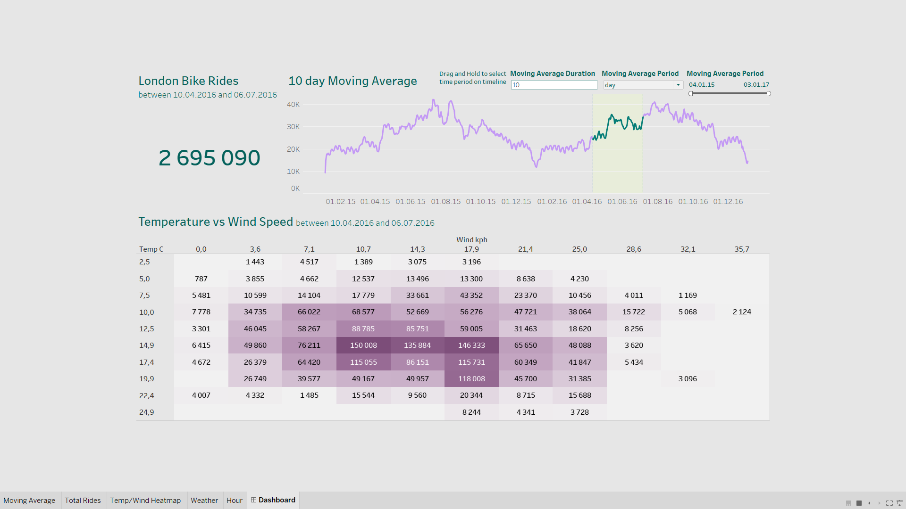
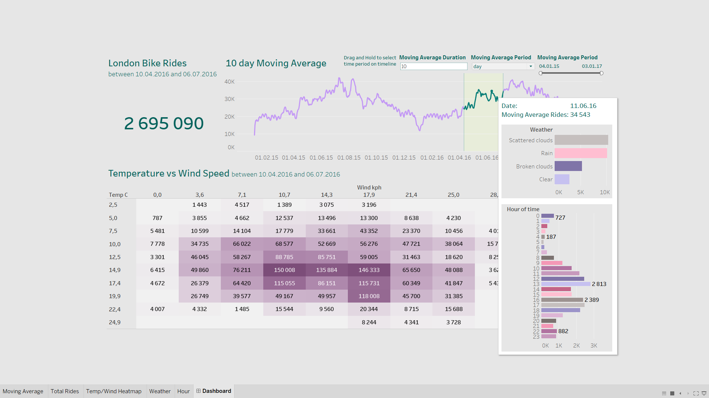

# London Bike Rides Analytics

Small study data viz project done along with [the walkthrough video on YouTube by Data With Mo](https://www.youtube.com/watch?v=nl9eZl1IOKI).

## About

This project is done with Python and Tableau.  
Python libraries: Pandas, Zipfile, and Kaggle(api).  
Done a quick data cleaning: renamed columns, mapped seasons and weather to string values.  
  
### Dashboard 
[link to Tableau Public](https://public.tableau.com/app/profile/diana.shatkovska/viz/London-Bike-Rides-Dashboard/Dashboard?publish=yes)  

On dashboard:
- **Total sum of rides** in selected date range.
- **Moving average line chart** with ability to select the date range and also customize the moving average duration and period.
- **Temperature and Wind Speed heatmap** in selected date range.  

On tooltips:
- Barchart of rides count in every weather type.
- Barchart of rides count on every hour of the day.

*(also works on heatmap cells)*

### Summary

Using this simple viz we can define relationships between the bikerides popularity and weather conditions in London.  
Also it is might be usefull to roughly predict ride trends based on weather forecasts.

## Credits
Kaggle Dataset: https://www.kaggle.com/datasets/hmavrodiev/london-bike-sharing-dataset  
Project video by Data With Mo: https://www.youtube.com/watch?v=nl9eZl1IOKI
